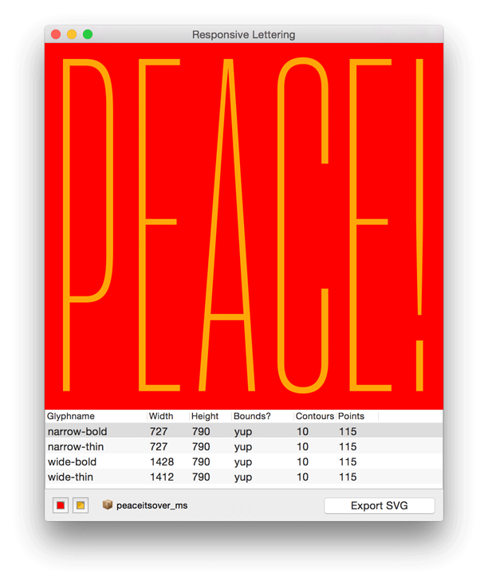
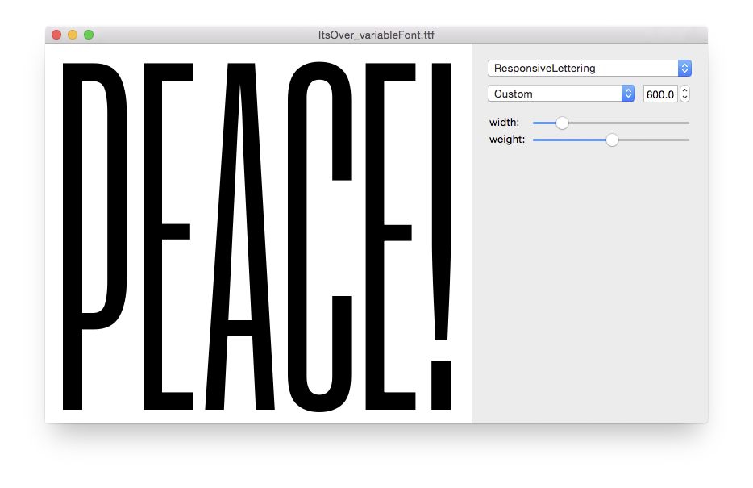

# responsiveLettering

Responsive lettering: scalable, interpolating vector shapes that can make themselves fit in a range of rectangles.

* <a href="http://letterror.com/dev/mathshapes/">More examples here.</a>
* An <a href="http://letterror.github.io/responsiveLettering/www/introduction.html">introduction of the parts is here.</a>

The python code consists of a couple of scripts to generate the SVG needed for responsive lettering. These are also included in the RoboFontExtension. All scripts are for <a href="http://doc.robofont.com">RoboFont</a>.

The www/ folder contains a working example. As it is loading .js and .json files it might be necessary to serve the files from a real server. When everything works it should look something like <a href="http://letterror.github.io/responsiveLettering/www/index.html">this</a>.

The www code depends on

 * jQuery, but probably not a very specific version
 * snap.js, a very handy library for manipulating SVG data.

All the vector data comes from json, so in theory it might be possible to rewrite all this without snap.js. 

## Robofont extension

The RoboFont extension is a useful tool for previewing and exporting vector work in a UFO to mathshape data. It can also be installed director from <a href="http://www.robofontmechanic.com">RoboFontMechanic</a>.

## Export to Designspace

Version 1.7 introduces a simple export to [designspace](https://github.com/LettError/designSpaceDocument) with separate master UFOs, which is useful if you want to generate a variable font from the data using [Batch](https://github.com/typemytype/batchRoboFontExtension). The exporter makes some assumptions about the glyph names in the source file. These are valid glyphnames (depending on the model):

* narrow-thin
* wide-thin
* medium-thin
* narrow-bold
* wide-bold

The script checks the `font.lib entry` at `com.letterror.mathshape.designspace` for information about the designspace topology. If you worked from a template generated with this extension then the settings are probably right. If there is no entry in the lib the script assumes a twobytwo designspace.

* `twobytwo`: two axes, four masters
* `twobyone`: one axis, two masters
* `threebyone`: one axis, three masters

## Credits

Ideas and code very much in debt to <a href="http://www.typosansplomb.com/ResponsiveInterpolation/" target="_new">Jeremie Hornus</a>, <a href="http://typologic.nl/news/live-font-interpolation-with-svg/" target="_new">Nina Stössinger</a>, <a href="http://alistapart.com/article/live-font-interpolation-on-the-web" target="_new">Andrew Johnson</a>, <a href="http://onuryazicigil.com" target="_new">Onur Yazıcıgil</a>, and <a href="http://nicksherman.com" target="_new">Nick Sherman</a>.

## License

The Responsive Lettering package is published under the [BSD-3 license](http://opensource.org/licenses/BSD-3-Clause).
